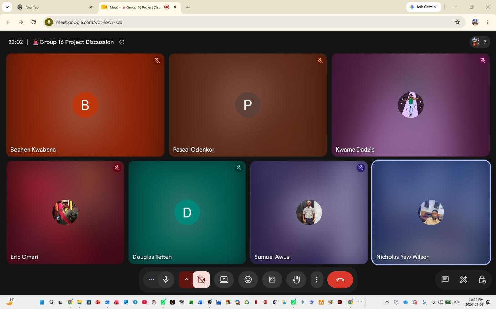
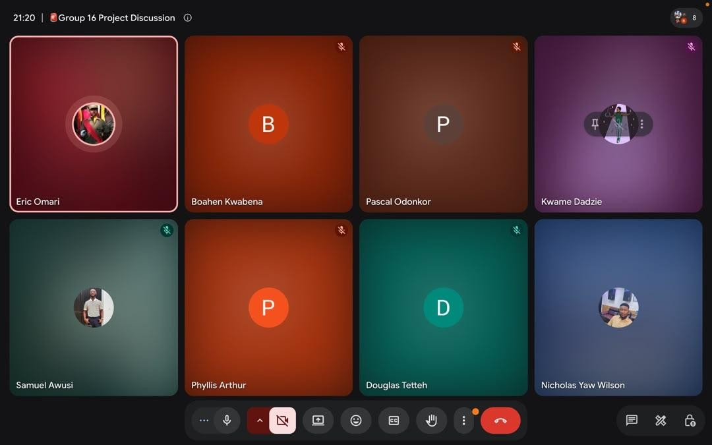
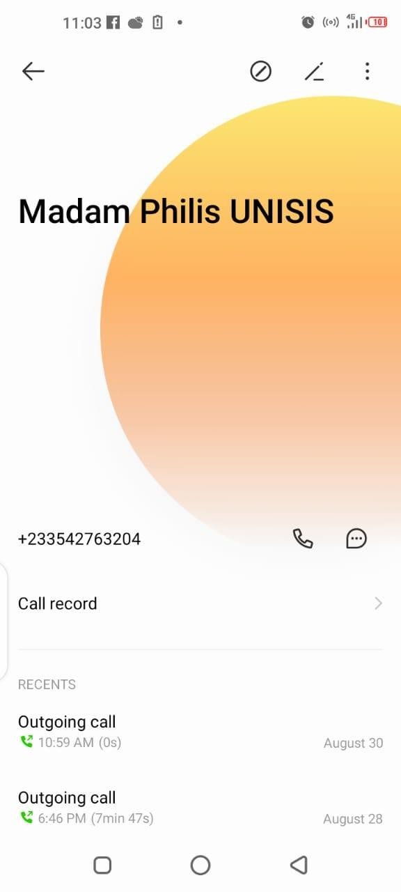
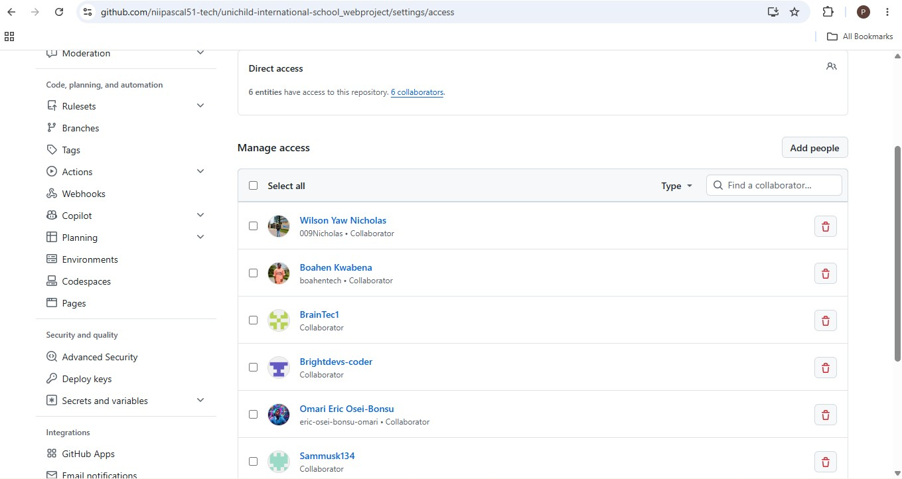
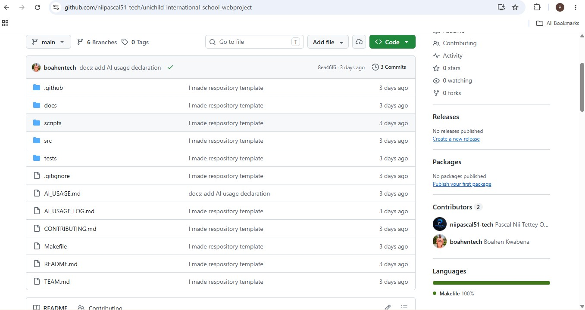
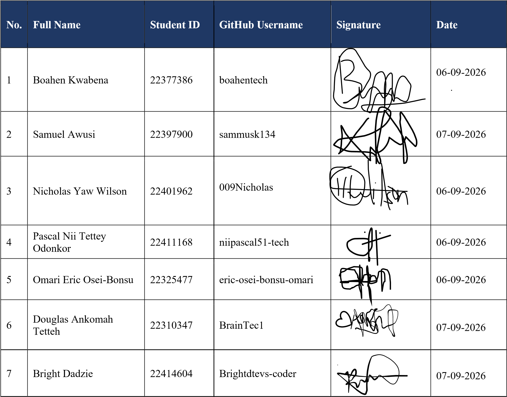

# UNIVERSITY OF GHANA

# DCIT 208 – SOFTWARE ENGINEERING

# DELIVERABLE 0

# Team Name: DevForge

Project Working Title: Unichild International School Webapp Development

Tagline: “Code with Purpose, Build with Impact.”

Contents: Part A – Team Identity | Part B – Team Operating Agreement | Part C – Client and Problem Intake | Part D – Repository and Platform Setup | Part E – AI Contracts

## D0-A: Team Identity

Team Charter, Client Intake, Repository Setup and AI Contract

### 1. Team Identity

This section presents the identity and membership of DevForge for the DCIT 208 D0-A deliverable. 1.1 Team Members

| No. | Full Name | Student ID | GitHub Username | Role |
|---|---|---|---|---|
| 1 | Boahen Kwabena | 22377386 | boahentech | Documentation and Deployment |
| 2 | Omari Eric Osei-Bonsu | 22325477 | eric-oseibonsu-omari | Client Liaison and Content |
| 3 | Pascal Nii Tettey Odonkor | 22411168 | NIIPASCAL51-TECH | Back-End Software Developer |
| 4 | Bright Dadzie | 22414604 | BRIGHTDEVSCODER | Front-End Developer |
| 5 | Douglas Ankomah Tetteh | 22310347 | BrainTec1 | Project Manager |
| 6 | Samuel Awusi | 22397900 | sammukis134 | Quality Assurance and Tester |
| 7 | Nicholas Yaw Wilson | 22401962 | 009Nicholas | Primary Team Contact / UI/UX Designer |

#### 1.2 Member Biographies

##### Member: Boahen Kwabena

I am a dedicated and ambitious Information Technology student at the University of Ghana, pursuing a Bachelor of Science in Information Technology through distance education. I combine my studies with professional work, which has helped me develop strong time management, discipline, adaptability, and communication skills. I have a strong interest in software development, database management, web technologies, data structures, and emerging technologies. I am hardworking, responsible, and always willing to learn new skills and take on challenges. My goal is to build a successful career in the IT industry while contributing positively to organizations through innovation, teamwork, and continuous growth.

##### Member: Omari Eric Osei-Bonsu

I am a motivated and hardworking student with a strong interest in technology, programming, and software development. I enjoy learning new concepts and applying my knowledge to solve problems and create practical solutions. Through my academic work and personal projects, I am developing my skills in programming, problem solving, teamwork, and logical thinking. I am always willing to learn, improve my abilities, and take on new challenges. I believe that continuous learning and practical experience are important for becoming a successful software professional. My goal is to develop useful and reliable software while gaining more experience in the field of technology. I look forward to working with others, contributing my ideas, and building my knowledge as I progress in my studies and future career.

##### Member: Pascal Nii Tettey Odonkor

I am a motivated and aspiring Software Engineering student with a strong interest in technology, programming, and developing practical solutions to real-world problems. I am committed to continuously improving my technical knowledge and gaining hands-on experience in software development. Through my studies and personal projects, I have developed skills in problem-solving, logical thinking, teamwork, and programming. I approach challenges with curiosity, discipline, and a willingness to learn. I am particularly interested in building reliable, user-focused software and exploring emerging technologies. I am eager to contribute my skills to a professional environment while learning from experienced developers and growing as a software engineer.

##### Member: Bright Dadzie

I am a BSc Information Technology student with a growing interest in software engineering and cybersecurity. I

have developed practical skills in HTML, CSS, Java, basic Python, and C++. Through academic and personal projects, I have gained experience developing web applications for a school and a technology retail business, which has helped me improve my problem-solving and web development abilities. As a Front-End Developer on the team, I am responsible for contributing to the design and development of the user interface and ensuring that the application is easy to use. My career goal is to become a skilled Full-Stack Developer.

##### Member: Douglas Ankomah Tetteh

I am a Level 200 BSc Information Technology student at the University of Ghana, aspiring to specialize as a Back-End Software Developer. Proficient in Java and C++, I enjoy designing clean, efficient, and scalable serverside architecture to solve complex logic challenges. Recently, I built a web application for an educational institution as a school project, strengthening my skills in backend integration and application logic. I am eager to expand my technical toolkit, contribute to backend projects, and connect with industry professionals.

##### Member: Samuel Awusi

My name is Samuel Awusi, a student of the University of Ghana, pursuing Bachelor of Science in Information Technology. I have a strong passion for technology and software development, with a particular interest in becoming a professional Full-Stack Developer. I am motivated to develop my programming, problem-solving, and software engineering skills through academic studies and practical projects. I enjoy learning new technologies and applying my knowledge to create useful and innovative solutions. My goal is to become a highly skilled IT professional.

##### Member: Nicholas Yaw Wilson

I am a passionate and dedicated Information Technology student at the University of Ghana, pursuing Bachelor of Science in Information Technology through distance education. I have a strong interest in UI/UX design and digital product development, with a focus on creating intuitive, accessible, and visually engaging user experiences that solve real-world problems. As a UI/UX Designer, I apply user-centred design principles to develop wireframes, prototypes, user flows, and responsive interfaces using modern design tools such as Figma. I enjoy transforming ideas into practical digital experiences while collaborating with developers, project managers, and other team members. Through academic and software engineering projects, I continue to strengthen my creativity, problem-solving, communication, and technical skills while gaining valuable practical experience in designing functional and user-friendly digital products.

#### 1.3 Team Contacts

| Primary Team Contact | Nicholas Yaw Wilson \| nywilson002@st.ug.edu.gh \| 0536551034 |
|---|---|
| Deputy Team Contact | Pascal Nii Tettey Odonkor \| pascalniitetteyodonkor@gmail.com / pntodonkor@st.ug.edu.gh \| 0530294358 / 0505709372 |

#### 1.4 Team Meeting Evidence

Team meeting evidence (Google Meet, Group 16 Project Discussion).

#### 1.5 Submission Verification

Before submission, the team should verify all names, student IDs, email addresses, contact numbers, GitHub usernames, roles, and biographies. The team should also confirm that the project title, team name, tagline, primary contact, deputy contact, and meeting evidence are complete.

### D0-B: Team Operating Agreement

#### 1. Communication Tools and Response Times

Primary communication: WhatsApp will be used for general team communication, announcements, reminders, and urgent matters.

Project communication: Google Meet will be used for official project meetings and discussions where necessary.

Response time: Team members are expected to acknowledge important messages within 6 hours and respond to task-related messages within 24 hours.

Members who will be unavailable for an extended period should inform the team in advance.

#### 2. Meeting Schedule, Attendance and Documentation

Regular meetings: The team will meet every Monday, Wednesday, and Friday (MWF) from 9pm to 11pm unless otherwise agreed.

Attendance: All members are expected to attend meetings and arrive on time.

A member who cannot attend must notify the team beforehand and provide a valid reason.

Minute-taking: A designated secretary/minute-taker will record attendance, key discussions, decisions, assigned tasks, and deadlines.

Decision recording: Major decisions will be documented in the meeting minutes or the team's shared project documentation. Decisions affecting the project will be based on team consensus or a majority vote where consensus cannot be reached.

#### 3. Work Division and Task Management

Tasks will be divided according to each member's skills, availability, and workload.

Every task must have a clearly identified owner, deadline, and expected deliverable.

Task assignments will be recorded in the team's project management system or shared document.

Completed tasks must be submitted for review before being considered finished.

A task will only be marked as accepted after the assigned reviewer confirms that it meets the agreed requirements and quality standards.

Members may request assistance or redistribution of tasks when workload or technical difficulties make the original assignment impractical.

#### 4. Version-Control Rules

The team will use Git/GitHub for version control.

Branch naming: feature/feature-name, fix/issue-name, docs/document-name

Commit messages: short, clear, and descriptive (e.g. feat: add student registration page; fix: resolve login validation issue; docs: update project report)

Pull requests: PRs should be kept reasonably small and focused on one feature, fix, or logical change.

Large changes should be divided into smaller PRs where practical.

Reviewers: Every PR should be reviewed by at least one other team member before merging.

Merge rules: Members should not merge their own PRs without review and approval. The main branch must remain stable and should contain only reviewed and working code.

Direct commits to the main branch are discouraged except for agreed administrative or emergency changes.

#### 5. Conflict Resolution and Non-Participation

Team disagreements should first be addressed through respectful discussion between the affected members.

If the issue cannot be resolved, the team leader/coordinator will facilitate a discussion and, where necessary, the team will vote on the matter.

Late work: Members who anticipate missing a deadline must notify the team as early as possible and provide a revised completion time.

Non-participation: Repeated failure to complete assigned tasks without communication will be documented and may result in reassignment of responsibilities.

Ghosting: A member who repeatedly ignores team communication, meetings, and assigned tasks without explanation will be formally warned and may have their contribution reported to the appropriate lecturer or supervisor.

Academic dishonesty: Plagiarism, fabrication of work, submitting another person's work as one's own, or any other form of academic misconduct is strictly prohibited. Suspected cases will be addressed immediately and, where appropriate, reported to the lecturer.

Serious or repeated violations may result in the member's responsibilities being reduced, reassigned, or formally reported to the lecturer in accordance with university rules.

#### 6. Submission Process

The designated submission coordinator will be responsible for preparing and uploading the final assignment to Sakai.

Before submission, at least one other team member, at most all team members will review the final files to confirm that all required components are present, correctly formatted, and ready for submission.

The team will observe an internal submission freeze at 4:00 p.m., one hour before the official 5:00 p.m.

deadline.

All final contributions, corrections, and files must therefore be submitted to the team coordinator by 4:00 p.m.

From 4:00 p.m. onward, only essential corrections approved by the team coordinator/reviewer should be made.

The submission coordinator should upload the final version before 5:00 p.m. and provide confirmation/proof of submission to the team.

The team should not wait until the final minutes to begin the Sakai upload process.

### D0-C: Client and Problem Intake

#### 1. Intended Client

The intended client for the proposed system is Unichild International School. The school provides education from Creche, Nursery, Kindergarten and Primary through Junior High School (JHS).

| Organization | Unichild International School |
|---|---|
| School Type | Creche, Nursery, Kindergarten, Primary and JHS |
| Address | IH41 Bletse St. GW-0926-5269 |
| Contact | +233 244 891 066 / +233 558 636 562 |
| Email | Unichildschool11@gmail.com |
| Office Hours | Monday–Friday, 6:30 AM–4:00 PM |

The school's primary audience includes:

Prospective parents

Current students

Staff

Members of the community

#### 2. Initial Client Problem Statement

Unichild International School requires a centralized web-based system to make important school information and services easier for its stakeholders to access and manage. The system should provide information about the school, academics, admissions, departments, events, news and contact details.

The client also requires administrative features for managing students, teachers, admissions, results, fees, news and school events. The administrator should be able to register and admit new students online and create student accounts after admission. Teachers should have accounts through which they can view students and upload students' results, while students should be able to access their accounts and view their results and fee status.

The system should also support online admission management by the administrator, downloadable and printable PDF information, an event calendar, WhatsApp contact, Google Maps and communication through the school's contact details.

#### 3. Evidence of First Contact

Evidence of the team's initial contact with Unichild International School is provided below.

Figure 1: Evidence of initial meeting with the client, Unichild International School.

Figure 2: Evidence of call logs with the client.

#### 4. Initial List of User Groups

The initial user groups identified from the client's requirements are:

Administrator

The administrator is the main system manager and represents the client. The administrator will be responsible for registering and admitting students, creating student accounts, managing school information, managing results and fees, and publishing news and events.

Teachers/Staff

Teachers will have their own accounts. They will be able to view students and upload students' academic results.

Students

Students will receive accounts created by the administrator after they have been admitted. Students will be able to access their accounts, view their results and check their fee status.

Prospective Parents

Prospective parents will mainly use the public website to access school information, admission requirements, application information, fees, school activities and contact details.

Community/Public Visitors

Members of the community and other visitors will be able to access general school information, news, events, academics, departments, contact information and other publicly available content.

#### 5. Fallback Plan

If Unichild International School becomes unavailable before the next project deadline, the team will contact another suitable school or educational institution with similar academic and administrative needs. The team will gather the necessary requirements from the alternative client and adjust the proposed system where necessary.

The team will also preserve the requirements and information already gathered from Unichild International School so that the project can continue without significant delay while a suitable alternative client is identified.

### D0-D: Repository and Platform Setup

Team GitHub Repository URL

https://github.com/niipascal51-tech/unichild-international-school_webproject.git

#### Proof of Team Access to the Repository

#### Proof of Repository Initialization

#### Team YouTube Channel Name and URL

Name: DevForge

URL: https://www.youtube.com/@DE-SEGP-16-DevForge

#### Sakai Group Submission Contact

Student Name: Nicholas Yaw Wilson

Student ID: 22401962

Role: Implementer (UI/UX Design)

### D0-E: AI Contract

AI Use and Academic Integrity Agreement

We, the members of the DCIT 208 project team, acknowledge that Artificial Intelligence (AI) tools may be used as learning and development aids throughout the project. However, we agree that AI must not replace our individual understanding, critical thinking, technical skills, or responsibility for the work we submit.

#### 1. AI May Assist, but Cannot Replace Understanding

AI tools may be used for activities such as brainstorming, explaining concepts, research assistance, debugging guidance, documentation, generating examples, and reviewing work. Each team member remains responsible for understanding, verifying, testing, and being able to explain any work produced with AI assistance.

#### 2. AI Usage Must Be Documented

All significant use of AI during the project will be recorded in the team's AI_USAGE.md file. The record will state the AI tool used, the purpose of its use, and how the output was reviewed, modified, tested, or incorporated.

#### 3. Protection of Confidential Information

We agree not to enter or upload confidential client information, passwords, credentials, API keys, private records, personal information, or other sensitive information into public AI tools. Where AI assistance is necessary, sensitive information will first be removed, anonymized, or replaced with suitable examples.

#### 4. Individual Understanding and Responsibility

Every team member is personally responsible for the work they contribute. Any member who is unable to explain, demonstrate, or defend their own contribution may receive zero individual credit for that work, in accordance with the project's academic integrity requirements.

#### 5. Verification of AI-Generated Content

AI-generated code, documentation, diagrams, suggestions, and other outputs must be reviewed by the team. We will verify their accuracy, relevance, security, originality, and compliance with the project requirements before incorporating them.

#### 6. Academic Honesty

We will not use AI to fabricate evidence, falsify client information, misrepresent another person's work as our own, or bypass the learning objectives and assessment requirements of the DCIT 208 project.

#### 7. Team Accountability

All team members agree to follow this AI Contract throughout the project. Each member is responsible for ensuring that their AI-assisted contributions are properly understood, tested, documented, and honestly represented.

#### Team Members' Acknowledgement

By signing below, each team member confirms that they have read, understood, and agreed to comply with this AI Contract throughout the DCIT 208 project.

Primary Team Contact: Nicholas Yaw Wilson | nywilson002@st.ug.edu.gh | 0536551034

Deputy Team Contact: Pascal Nii Tettey Odonkor | pascalniitetteyodonkor@gmail.com / pntodonkor@st.ug.edu.gh | 0530294358 / 0505709372

Date of Agreement: 6th September, 2026
